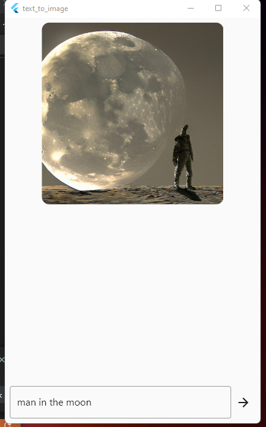

# FLUTTER + STABILITY AI
## TEXT TO IMAGE 

This project is an API CLIENT of the website https://stability.ai/ which has the ability to generate images based on text entered by the user. see the website for more information on this platform.

This project focuses on the use of the API designed for the Javascript language and converted to the Dart language through the package https://pub.dev/packages/stability_ai

## Screenshot

## Who to run this project
Install flutter folowing this article https://docs.flutter.dev/get-started/install or watch this video https://youtu.be/qs73Mtj-lPU

    
### In terminal or CMD, put following comands
<code>
    flutter pub get  
    flutter run -d
</code>
